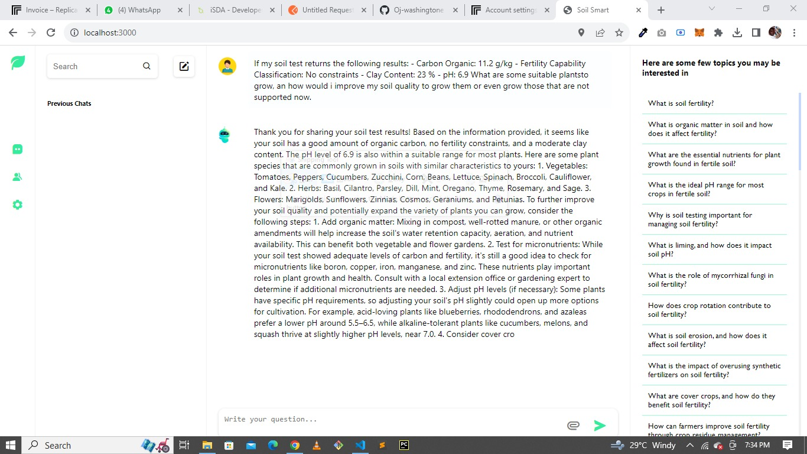
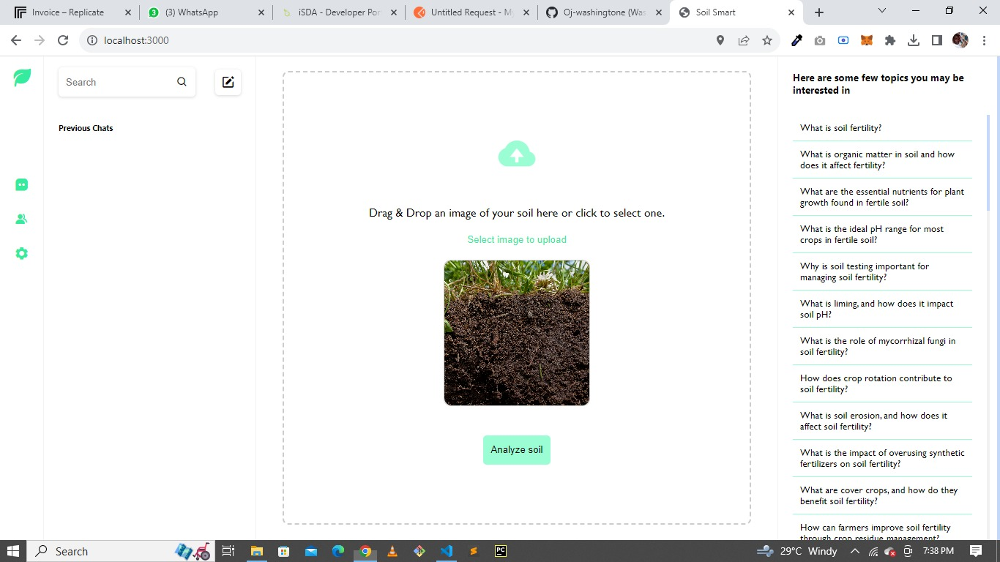

# Soil smart

Predict soil fertility and give comprehensive agricultural knowledge to farmers based on their soil and questions

## Introduction

This project leverages the power of Generative AI to enhance soil analysis. By using the Replicate with Llama 2-13b model, coupled with a small image analysis network implemented using OpenCV, SoilSmart Image Analysis aims to provide valuable insights into soil quality and composition.

## Project Structure

This is a Node.js project and it is organised as follows:

- The index.js file is the entry point to the project. it provides the key endpoints for accessing resources in the application
- Main key project files are in the app folder, which also contains the subfolder "Utils". This subfolder contains utility classes that we use to handle the core functionality of the system, including working with the Llama model for conversation. Inside the app js, the main file of the project is inex.html, which uses test.js, which is its primary js file, to handle its main functionalities. and a number of other key files, including .css

## Purpose

SoilSmart Image Analysis serves the purpose of assisting agricultural and environmental experts in analyzing soil samples. By employing image analysis techniques and Generative AI, it offers the following benefits:

Soil Quality Assessment: The project can assess soil quality based on image analysis, helping farmers and environmentalists make informed decisions about soil treatment and conservation.

Composition Analysis: It can provide insights into the composition of soil, including the presence of minerals, organic matter, and other vital components.

Predictive Insights: The Generative AI model, Replicate with Llama 2-13b, aids in making predictions about future soil conditions based on historical data and current observations.

## Generative AI Choice

The choice of using the Replicate with Llama 2-13b Generative AI model was driven by its proven ability to generate high-quality and contextually relevant data. In the context of this project, it enables us to generate valuable insights from soil images, aiding in more accurate soil analysis and predictions.

## Getting Started

To get started with SoilSmart Image Analysis, follow these steps:

## Clone this repository to your local machine.

1. install Node.js version 20.7.0 or later
2. Run `npm install` to install all the required packages
3. Launch the application by going to the root folder for the project and running ` node index.js` then navigate to your browser and visit `http://localhost:3000` to access the web application

## Screenshots

### Landing Page

### screenshot 1

### Screenshot 2

